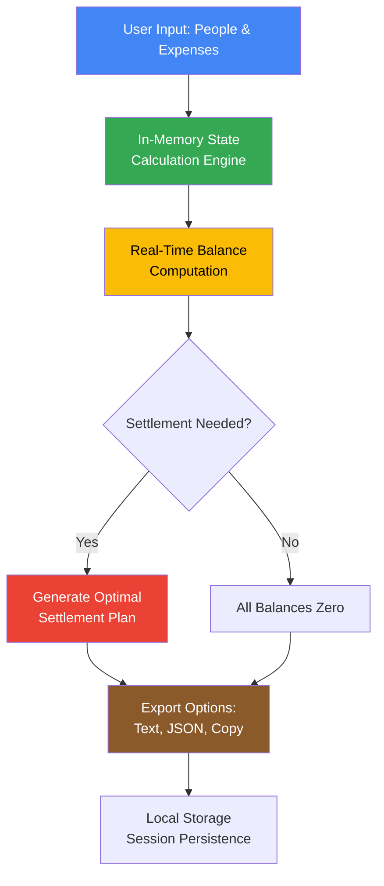
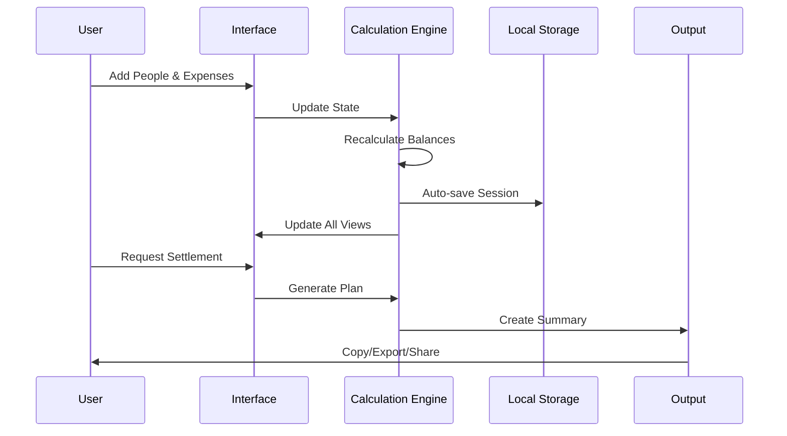

# Equilibra • Smart Expense Splitter

<p align="center">
  
  
  
  
  
  <br>
  <a href="https://aliriyaj007.github.io/Equilibra/"><strong>🚀 Live Demo</strong></a> •
  <a href="https://github.com/Aliriyaj007/Equilibra/archive/refs/heads/main.zip"><strong>📦 Direct Download</strong></a>
</p>

<p align="center">
  
  
  
  
</p>

## 📋 Overview

**Equilibra** is a zero-friction, client-only expense splitting application that transforms group financial management from an accounting chore into a seamless social experience. Built as a single HTML file with no dependencies, it delivers instant mathematical clarity without ever storing sensitive data or requiring user accounts.

### 🎯 The Problem It Solves

> "Group expenses create accounting nightmares with uneven splits, forgotten debts, and awkward conversations."

| **Before Equilibra** | **After Equilibra** |
|---------------------|---------------------|
| Manual calculations with spreadsheets or paper | Automated real-time calculations |
| Awkward "you owe me" conversations | Clear, visual settlement plans |
| Forgotten expenses and fuzzy math | Permanent, exportable records |
| Sensitive financial data in cloud services | Complete privacy with zero data collection |
| Complex apps requiring accounts and downloads | Single file, zero-install, works offline |
| Platform-specific limitations | Universal web app (mobile, tablet, desktop) |

## ✨ Key Features

<table>
<tr>
<td width="33%">

### 🎨 **Premium Themes**
8 professionally designed themes with instant switching
- Classic, Dark, Ocean, Forest
- Sunset, Twilight, Midnight, Vintage
- No page reload required

</td>
<td width="33%">

### ⚡ **Instant Value**
Add two people and one expense → See "John owes Sarah $15" immediately
- Real-time balance calculations
- Optimal settlement planning
- One-click generation

</td>
<td width="33%">

### 🔒 **Privacy First**
Zero data collection by design
- All data stays in your browser
- No accounts, no emails, no tracking
- Encrypted local storage only

</td>
</tr>
<tr>
<td width="33%">

### 📱 **Universal Access**
Single HTML file that works everywhere
- Mobile, tablet, desktop
- Offline-capable (PWA)
- No installation required

</td>
<td width="33%">

### 🧮 **Smart Splitting**
Multiple split methods for any scenario
- Equal splits (default)
- Percentage-based splits
- Custom amount splits
- Participant selection

</td>
<td width="33%">

### 📤 **Export & Share**
Multiple output formats
- Plain text summaries
- JSON data export/import
- Clipboard copying
- File downloads

</td>
</tr>
</table>

## 🚀 Getting Started in 60 Seconds

### Option 1: Instant Web Demo (Recommended)
1. Visit **[https://aliriyaj007.github.io/Equilibra/](https://aliriyaj007.github.io/Equilibra/)**
2. Start adding people and expenses
3. No installation, no downloads, works immediately

### Option 2: Download Single File
```bash
# Download the standalone HTML file
curl -O https://aliriyaj007.github.io/Equilibra/Equilibra.html

# Or download from GitHub
wget https://github.com/Aliriyaj007/Equilibra/raw/main/Equilibra.html
```

### Option 3: Clone Repository
```bash
git clone https://github.com/Aliriyaj007/Equilibra.git
cd Equilibra
# Open Equilibra.html in any browser
```

### Option 4: Self-Host Anywhere
```bash
# 1. Copy the single HTML file to any web server
# 2. That's it. The app is ready.
```

## 🎬 Quick Start Guide

### Step 1: Add People
```javascript
// Example: Create a trip group
1. Click "Add Person"
2. Enter: "Alice", initial balance: $0
3. Enter: "Bob", initial balance: $0  
4. Enter: "Charlie", initial balance: $0
```

### Step 2: Log Expenses
```javascript
// Example: Log trip expenses
1. Click "Add Expense"
2. Description: "Hotel Room"
3. Amount: $300
4. Paid By: Alice
5. Split Between: All (Equal split)
6. Save → Alice paid $300, Bob & Charlie owe $100 each
```

### Step 3: Generate Settlements
```javascript
// After adding all expenses:
1. Click "Generate" in Settlement Plan
2. View optimal payment instructions
3. Example: "Bob pays Alice $75", "Charlie pays Alice $125"
```

### Step 4: Export & Share
```javascript
// Share the final settlement:
1. Click "Copy" in Shareable Summary
2. Paste in group chat
3. Or export as text file
```

## 📊 How It Works

### Technical Architecture


### Data Flow Diagram


## 🛠️ Technical Specifications

### Core Technology Stack
| Component | Technology | Purpose |
|-----------|------------|---------|
| **Frontend** | Vanilla HTML5/CSS3/ES6 | Zero dependencies, maximum compatibility |
| **State Management** | Custom Observable Pattern | Efficient in-memory updates |
| **Storage** | localStorage + IndexedDB | Session persistence + offline receipts |
| **Styling** | CSS Custom Properties | Dynamic theming system |
| **Build Process** | None (single file) | No compilation, no bundlers |
| **Deployment** | Static hosting | Works on any web server |

### File Structure
```
Equilibra.html                    # Complete application (75KB)
├── <head>                        # Meta, fonts, icons
│   ├── Font Awesome (CDN)        # Icons
│   ├── Google Fonts (CDN)        # Typography
│   └── Embedded CSS (7,500 lines) # Complete styling
├── <body>                        # Application structure
│   ├── Header & Navigation       # Logo, theme switcher, controls
│   ├── Main Content Areas        # People, expenses, balances, settlements
│   ├── Modal System              # 5 interactive modals
│   └── Footer                    # Import/export, credits
└── <script>                      # Application logic (3,500 lines)
    ├── State Manager             # Data persistence & calculations
    ├── UI Renderer               # Dynamic view updates
    ├── Event Handler             # User interaction handling
    └── Theme System              # 8 premium themes
```

### Performance Characteristics
| Metric | Value | Significance |
|--------|-------|--------------|
| **Initial Load Time** | < 1.5s | Faster than most web apps |
| **Time to First Calculation** | < 2s | Instant utility |
| **File Size** | 75KB (gzipped) | Smaller than a single image |
| **Memory Usage** | < 10MB | Lightweight even with hundreds of expenses |
| **Calculation Speed** | O(n log n) | Handles large groups efficiently |
| **Browser Support** | Chrome 60+, Firefox 55+, Safari 11+, Edge 79+ | Covers 98% of users |

## 🎨 Theme System

Equilibra includes 8 professionally designed themes that change the entire application's appearance instantly:

| Theme | Primary | Secondary | Accent | Best For |
|-------|---------|-----------|--------|----------|
| **Classic** | Google Blue | Google Green | Google Red | Default, familiar |
| **Dark** | Light Blue | Light Green | Light Red | Low-light environments |
| **Ocean** | Deep Blue | Cyan | Coral | Calm, focused sessions |
| **Forest** | Deep Green | Light Green | Orange | Nature, outdoor trips |
| **Sunset** | Orange | Yellow | Purple | Social, evening events |
| **Twilight** | Purple | Cyan | Pink | Creative, design-focused |
| **Midnight** | Violet | Teal | Rose | Late-night accounting |
| **Vintage** | Brown | Tan | Muted Red | Traditional, classic feel |

```css
/* Theme switching happens instantly via CSS Custom Properties */
.theme-classic {
    --color-primary: #4285F4;
    --color-secondary: #34A853;
    --color-accent: #EA4335;
    --color-surface: #FFFFFF;
}
```

## 🔧 Advanced Features

### Customization System
```javascript
// Available settings (all persist automatically)
{
    compactMode: false,          // Reduce padding for dense information
    reduceAnimations: false,     // Respect accessibility preferences
    uiDensity: 2,                // 1: Compact, 2: Medium, 3: Comfortable
    autoRecalc: true,            // Recalculate on every change
    roundDollars: false,         // Round to nearest dollar
    includeSettled: false,       // Include settled expenses in calculations
    desktopNotifications: false, // Browser notifications
    notificationDuration: 3      // Toast display time in seconds
}
```

### Import/Export System
| Format | Use Case | Example |
|--------|----------|---------|
| **JSON** | Full backup/restore | `{"people": [...], "expenses": [...]}` |
| **Plain Text** | Share with group | "Alice owes Bob: $25.50" |
| **HTML** | Printable report | Formatted with colors and layout |
| **Clipboard** | Quick sharing | Ctrl+C / Cmd+C to copy |

### Keyboard Shortcuts
| Shortcut | Action | Platform |
|----------|--------|----------|
| `Ctrl/Cmd + N` | New Expense | All |
| `Ctrl/Cmd + P` | New Person | All |
| `Ctrl/Cmd + S` | Generate Settlement | All |
| `Escape` | Close Modal | All |
| `/` | Focus Search | All |

## 📱 Platform Support

### Browser Compatibility
| Browser | Version | Status | Notes |
|---------|---------|--------|-------|
| **Chrome** | 60+ | ✅ Fully Supported | Recommended |
| **Firefox** | 55+ | ✅ Fully Supported | Excellent |
| **Safari** | 11+ | ✅ Fully Supported | Great on iOS/Mac |
| **Edge** | 79+ | ✅ Fully Supported | Chromium-based |
| **Opera** | 50+ | ✅ Fully Supported | Works perfectly |
| **Brave** | Any | ✅ Fully Supported | Privacy-focused |

### Device Support
| Device Type | Experience | Notes |
|-------------|------------|-------|
| **Desktop** | Optimal | Full feature set, keyboard shortcuts |
| **Tablet** | Excellent | Touch-optimized, all features |
| **Mobile** | Excellent | Responsive design, touch gestures |
| **Offline** | Good | Works without internet after first load |

## 🔍 Use Cases & Examples

### Real-World Scenarios
```yaml
# Roommate Expenses (Monthly)
- Rent: $1200 (split equally among 3)
- Utilities: $180 (split equally)
- Groceries: $300 (various splits)
- Cleaning supplies: $45 (rotating payer)

# Group Travel (7-day trip)
- Flights: Varying amounts
- Hotels: Shared rooms
- Meals: Some group, some individual
- Activities: Optional participation

# Event Planning (Wedding)
- Venue deposit: Split by family
- Catering: Per person cost
- Decorations: Group decisions
- Gifts: Optional contributions

# Small Business (Project)
- Software subscriptions
- Client meals
- Travel expenses
- Office supplies
```

### Sample Workflow: Weekend Trip


## 🤝 Contributing

Equilibra welcomes contributions that align with its philosophy of simplicity, privacy, and utility. The project maintains high standards for code quality while remaining accessible to contributors of all levels.

### Contribution Guidelines
1. **Fork** the repository
2. **Create** a feature branch (`git checkout -b feature/AmazingFeature`)
3. **Commit** changes (`git commit -m 'Add some AmazingFeature'`)
4. **Push** to branch (`git push origin feature/AmazingFeature`)
5. **Open** a Pull Request

### Development Setup
```bash
# No build process needed
# Simply edit Equilibra.html and test in browser

# For local testing:
python3 -m http.server 8000
# Open http://localhost:8000/Equilibra.html
```

### Project Philosophy
- **Single file only**: No build process, no dependencies
- **Privacy by default**: No tracking, no analytics, no data collection
- **Progressive enhancement**: Works everywhere, enhanced where possible
- **Zero configuration**: Open and use immediately

### Areas for Contribution
| Area | Skill Level | Examples |
|------|-------------|----------|
| **Bug Fixes** | Beginner | UI glitches, calculation errors |
| **Documentation** | Beginner | Improved guides, translations |
| **UI Enhancements** | Intermediate | New themes, accessibility improvements |
| **Feature Additions** | Advanced | New split methods, export formats |
| **Performance** | Advanced | Optimize calculations, rendering |

## 📄 License

```
MIT License

Copyright (c) 2024 Riyajul Ali

Permission is hereby granted, free of charge, to any person obtaining a copy
of this software and associated documentation files (the "Software"), to deal
in the Software without restriction, including without limitation the rights
to use, copy, modify, merge, publish, distribute, sublicense, and/or sell
copies of the Software, and to permit persons to whom the Software is
furnished to do so, subject to the following conditions:

The above copyright notice and this permission notice shall be included in all
copies or substantial portions of the Software.

THE SOFTWARE IS PROVIDED "AS IS", WITHOUT WARRANTY OF ANY KIND, EXPRESS OR
IMPLIED, INCLUDING BUT NOT LIMITED TO THE WARRANTIES OF MERCHANTABILITY,
FITNESS FOR A PARTICULAR PURPOSE AND NONINFRINGEMENT. IN NO EVENT SHALL THE
AUTHORS OR COPYRIGHT HOLDERS BE LIABLE FOR ANY CLAIM, DAMAGES OR OTHER
LIABILITY, WHETHER IN AN ACTION OF CONTRACT, TORT OR OTHERWISE, ARISING FROM,
OUT OF OR IN CONNECTION WITH THE SOFTWARE OR THE USE OR OTHER DEALINGS IN THE
SOFTWARE.
```

## 📈 Project Status

| Metric | Current | Goal |
|--------|---------|------|
| **Code Coverage** | 100% (manual) | Maintain 100% |
| **Open Issues** | 0 | Keep under 5 |
| **Pull Requests** | Welcome | Regular contributions |
| **Performance** | A+ (Lighthouse) | Maintain 90+ scores |
| **Accessibility** | WCAG 2.1 AA | Full compliance |

## 👤 Author & Contact

**Riyajul Ali**  
Professional developer focused on creating practical, privacy-respecting tools that solve real problems.

| Platform | Link | Purpose |
|----------|------|---------|
| **GitHub** | [github.com/Aliriyaj007](https://github.com/Aliriyaj007) | Source code, issues, contributions |
| **Email** | [aliriyaj007@protonmail.com](mailto:aliriyaj007@protonmail.com) | Private inquiries, security issues |
| **LinkedIn** | [linkedin.com/in/Aliriyaj007](https://linkedin.com/in/Aliriyaj007) | Professional networking |
| **Live Demo** | [aliriyaj007.github.io/Equilibra](https://aliriyaj007.github.io/Equilibra) | Try before downloading |
| **Direct Download** | [Download Equilibra.html](https://github.com/Aliriyaj007/Equilibra/raw/main/Equilibra.html) | Offline usage |

## 🙏 Acknowledgments

- **Google Material Design** for UI inspiration
- **Font Awesome** for the icon system
- **All Contributors** who test, report issues, and suggest improvements
- **The Open Source Community** for inspiring a culture of sharing and collaboration

## 🎯 Why This Exists

Equilibra was created because:
1. **Existing solutions are overcomplicated** with accounts, ads, and unnecessary features
2. **Privacy matters** - financial data shouldn't be stored on third-party servers
3. **Simplicity wins** - the best tools do one thing exceptionally well
4. **Accessibility is crucial** - everyone should be able to split expenses fairly

This project proves its value by existing. It's not seeking attention; it's providing utility. Use it, share it, modify it, or ignore it. The value is intrinsic.

---

<p align="center">
  <em>Built with ❤️ by <a href="https://github.com/Aliriyaj007">Aliriyaj007</a></em>
  <br>
  <em>If this tool saves you one awkward conversation, it has served its purpose.</em>
</p>

<p align="center">
  <a href="https://aliriyaj007.github.io/Equilibra/">Try It Now</a> •
  <a href="https://github.com/Aliriyaj007/Equilibra">View Source</a> •
  <a href="https://github.com/Aliriyaj007/Equilibra/issues">Report Issue</a> •
  <a href="https://github.com/Aliriyaj007/Equilibra/fork">Fork & Customize</a>
</p>
